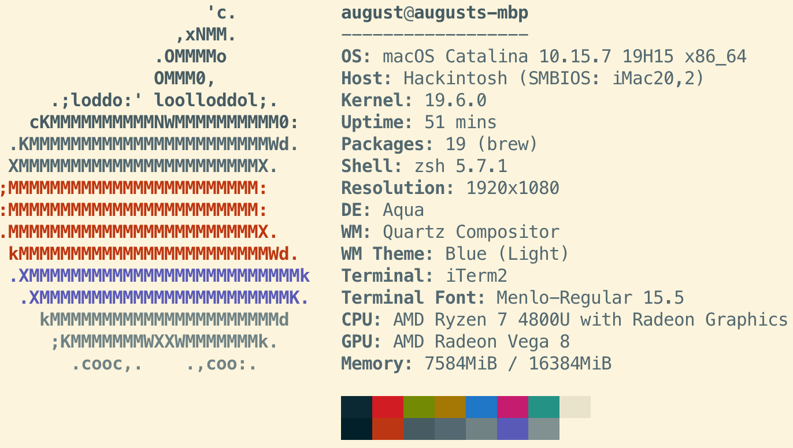

# Hackintosh-SER4-4800U

## 电脑配置
|规格 | 详细信息|
|:-: | :-:|
|电脑型号|零刻SER4|
|操作系统|macOS （Ventura / Monterey / Big Sur / Catalina|
|处理器|AMD 4800U|
|显卡|AMD Radeon Vega 8|
|内存|16GB|
|硬盘|970 EVO PLUS|
|声卡| Realtek ALC269|

## 正常工作
- 显卡
- 声卡
- 有线网卡
- 定制USB
- ACPI
- 睡眠, 配置休眠模式
```
sudo pmset autopoweroff 0
sudo pmset powernap 0
sudo pmset standby 0
sudo pmset proximitywake 0
sudo pmset tcpkeepalive 0
sudo pmset -c hibernatemode 25
```


|软件| 兼容性|
|:-: | :-:|
|Parallels Desktop(13.1.0)|除非 AppleHV 最高使用到 13.1.1 2 3|
|VirtualBox(6.1.26)|性能显着降低。|
|VMWare Fusion(10.1.6)|此补丁仅适用于 Catalina 及更早版本的 Catalina 。|
|Docker|只是VirtualBox 或 Docker 工具箱中的 Docker。|
|安卓模拟器|仅兼容Android-x86 VM 软件。|
|iOS模拟器(Xcode_12.4)|它工作顺利。|
1. Parallels 在 Big Sur 和更新版本中默认不工作，您需要使用环境变量 SYSTEM_VERSION_COMPAT=1。
2. 使用Docker可参考 [Ryzentosh](https://jetstudy.net/docker/install-docker-in-amd-hackintosh-ryzentosh-system/)

## 不正常工作
- 未找到MT7921K(RZ608)WIFI及蓝牙的驱动
